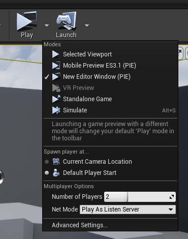

# Unreal-Engine-CPP-Samples
C++ samples for Unreal Engine 4.27 and 5+ development. Includes my own implementations and extensions of the <a href="https://dev.epicgames.com/documentation/en-us/unreal-engine/unreal-engine-5-5-documentation">Unreal Engine 5.5 documentation</a> programming demos, all in one place, because I felt like there was a lack of resources available for developers who already are familiar with C++, and are looking for examples of how to use it in the context of Unreal. 

### Using these samples
Copy the desired header and C++ files into your UE5 project, rebuild the project, then open the project in the editor. The desired functionality should be added to the project. Each sample may require an initial scene setup before use.

## Samples

### Multiplayer Networking: Replication / RPC

#### <a href="https://github.com/nicholaswile/Unreal-Engine-CPP-Samples/tree/main/multiplayernetworking">Code</a>

This works in both Unreal Engine 4.27 and 5+. I tested using UE4 due to it's faster performance on my laptop. The code extends the third person character class to allow replication of projectile functionality and player health. The left display is the server and the right is the client that connects to it. This code uses remote procedure calls for certain functions, meaning when the client attempts to call a function, it is enqueued and then dequeued once the server receives it. The server calls the function, then notifies the clients. This is how multiplayer is synchronized.

To test this, you may start with a third person framework and modify the following settings:
* Number of players: 2
* Net mode: Play as a listen server

### Custom Character Class: Animated Third Person Character

#### <a href="https://github.com/nicholaswile/Unreal-Engine-5-CPP-Samples/tree/main/thirdpersoncharacter">Code</a>

You'll have to setup animations using the Blueprint state machines and blend shapes. Animation and model assets can be found from the <a href="https://www.fab.com/listings/98ff449d-79db-4f54-9303-75486c4fb9d9">Epic Games asset library</a> for free. 

The locomotion blend shape for the character animations.

|Controls|Actions|
|:----|:----|
|`W`| Forward |
|`S`| Backward |
|`A`| Left |
|`D`| Right |
|`Mouse X`| Camera Yaw |
|`Mouse Y`| Camera Pitch|
|`Shift`| Sprint|
|`Ctrl`| Crouch|

### Custom Character Class: Animated FPS Controller

#### <a href="https://github.com/nicholaswile/Unreal-Engine-5-CPP-Samples/tree/main/fpscontrol">Code</a>

Gun not included. You'll have to setup your own animations through Blueprint state machines. Animation and model assets can be found in the Docs. But all the C++ files needed to implement this are included in my repo. 

|Controls|Actions|
|:----|:----|
|`W`| Forward |
|`S`| Backward |
|`A`| Left |
|`D`| Right |
|`Mouse X`| Camera Yaw |
|`Mouse Y`| Camera Pitch|
|`Shift/RMB`| Camera Zoom|
|`Space/LMB`| Shoot|

### Custom Pawn Class: Third Person Camera Controller

#### <a href="https://github.com/nicholaswile/Unreal-Engine-5-CPP-Samples/tree/main/thirdpersoncam">Code</a>

| Controls | Actions |
|:---|:---|
|`W`| Forward |
|`S`| Backward |
|`A`| Left |
|`D`| Right |
|`Mouse X`| Camera Yaw |
|`Mouse Y`| Camera Pitch|
|`Shift/RMB`| Camera Zoom|

You must bind axes and actions in the project input settings corresponding to each ability.

### Custom Actor Class: Transitioning Cameras

#### <a href="https://github.com/nicholaswile/Unreal-Engine-5-CPP-Samples/tree/main/cameratransitions">Code</a> 

Add an instance of the custom class to the scene, then populate the struct with at least one camera in the scene. For each camera in the structure, specify a length of time for its transition duration.

### Custom Actor Class: Levitating Actor with Particle Effect

#### <a href="https://github.com/nicholaswile/Unreal-Engine-5-CPP-Samples/tree/main/levitating">Code</a>

In the content browser, drag the Levitating Actor class from the C++ Classes folder into the scene.

### Custom Pawn Class: Player Input (Static Camera)

#### <a href="https://github.com/nicholaswile/Unreal-Engine-5-CPP-Samples/tree/main/playerinput">Code</a>

In the project settings, create input axis mappings for MoveX and MoveY, and input action mappings for Grow. This program binds those actions to a custom player pawn. Set a mesh such as a cylinder so the player is visible.

### References
* <a href="https://dev.epicgames.com/documentation/en-us/unreal-engine/unreal-engine-cpp-programming-tutorials">Unreal Engine 5 C++ Documentation</a>. Each of my sample implementations is based off of different gameplay features discucsed in that section of the docs.
<!--
Makoto Model:
"Makoto Yuki (Con Arte Lineal)" (https://skfb.ly/prtHQ) by 雨宮レン is licensed under Creative Commons Attribution (http://creativecommons.org/licenses/by/4.0/). DeviantArt: https://www.deviantart.com/ultimatemmd/art/Yuki-Makoto-Persona-3-Reload-MMD-DL-1017926733. Originally dumped by REALMadMax1960: https://x.com/REALMadMax1960.
-->
